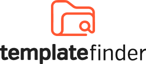

    
    <h2 align="center">
        Encontre templates para seus projetos.
    </h2>

 

Gostou do projeto? Considere <a href="#">contrubuir</a> para nos ajudar a mater!

 

# Sobre o projeto

Projeto de contribuição para comunidade de desenvolvimento! A ideia do projeto é ajudar os devs a encontrarem templates para seus projetos com toda estrutura de pastas e arquivos.

## De onde surgiu a ideia?

Durante uma discussão sobre nodeJS identifiquei alguns pontos que poderiam ser melhorados para ajudar a comunidade:

- **Porque não existe templates para nodeJS ?**
- **Teríamos que sempre criar as mesmas pastas e estruturas ?**

Tentei achar uma forma de construir estes templates e disponibilizá-los, consequentemente utilizei o github, uma ferramenta que podemos colocar arquivos e contribuições, criando lá 2 templates: um com _mongoDB_ e outro com _postgres_.

Senti que os templates poderiam ser encontrados de uma forma mais rápida e não ter que procurar entre vários perfis, com isso tive a ideia de criar uma aplicação para qualquer pessoa visualizar e adicionar templates usando os repositórios do github. **Um projeto para comunidade, criado pela comunidade**.

# Contribuições

- Todos podem contribuir, através do [discord](https://discord.gg/8DP5TaM) ou pelas [issues](https://github.com/marcoshenrique-dev/template-finder/issues/new/choose).
- Contribua também com o [design](https://www.figma.com/file/laRLmG1duFmHMfrmdfzeIf/template-finder-contribui%C3%A7%C3%B5es?node-id=427%3A2).
   

## Agradecimentos

---

Feito com ❤ para a **comunidade**.
